# horizontal_weekly_calendar

A horizontal-first calendar UI kit for Flutter — a three-line date strip that
grows into agendas, timelines, month grids, pickers, and home-screen widgets,
all sharing one date engine and one set of design tokens.

[](https://pub.dev/packages/horizontal_weekly_calendar)
[](https://pub.dev/packages/horizontal_weekly_calendar/score)
[](https://pub.dev/packages/horizontal_weekly_calendar)
[](LICENSE)

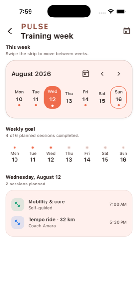

**Contents** — [Quick start](#quick-start) · [Every surface, with screenshots](#every-surface)
· [Correct dates](#correct-dates) · [Size](#size) · [Theming](#theming)
· [Motion](#motion) · [Selection](#selection) · [Events](#events)
· [Accessibility](#accessibility) · [Upgrading from 1.x](#upgrading-from-1x)

---

## Quick start

```yaml
dependencies:
  horizontal_weekly_calendar: ^2.0.0
```

```dart
import 'package:horizontal_weekly_calendar/horizontal_weekly_calendar.dart';
```

One date and one callback is the whole integration. Your app owns the state:

```dart
class Agenda extends StatefulWidget {
  const Agenda({super.key});

  @override
  State<Agenda> createState() => _AgendaState();
}

class _AgendaState extends State<Agenda> {
  DateTime _selected = DateTime.now();

  @override
  Widget build(BuildContext context) {
    return HorizontalCalendar(
      selectedDate: _selected,
      onDateSelected: (date) => setState(() => _selected = date),
    );
  }
}
```

That renders seven contiguous dates, adapts to Material or Cupertino, follows
the device locale, first day of week, text direction, dark mode, high contrast,
and reduced motion, and never mutates your state behind your back.

---

## Every surface

Each screenshot below is a real screen from the example app, captured on an
iPhone simulator. Run any of them with:

```sh
cd example && flutter run --dart-define=CALENDAR_ROUTE=/real-world/<id>
```

### Week strip — `HorizontalCalendar`

The flagship. A page of dates that fits its container is laid out edge to edge;
drags move it under your finger and settle on a spring.


```dart
HorizontalCalendar<Session>(
  selectedDate: selected,
  onDateSelected: (date) => setState(() => selected = date),
  events: sessions,
  appearance: CalendarAppearance(
    eventIndicatorStyle: EventIndicatorStyle.dot,
    motion: CalendarMotion.spring(),
  ),
)
```

*Example id: `training-week`*

### Date carousel — `CalendarDateCarousel`

Rich date cards carrying your own metadata. Snaps one card at a time; the
spotlight layout eases each card toward the viewport centre as you scroll.

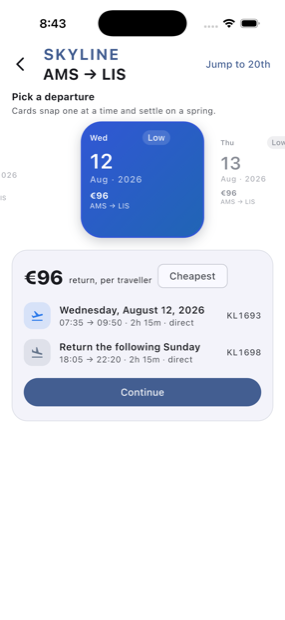

```dart
CalendarDateCarousel<Fare>(
  startDate: DateTime(2026, 8, 10),
  dayCount: 12,
  selectedDate: selected,
  onDateSelected: (date) => setState(() => selected = date),
  onItemSelected: (item) => print(item?.data),   // your record, unchanged
  items: [
    CalendarCarouselItem(date: DateTime(2026, 8, 12), title: '€96', badge: 'Low'),
  ],
  visualStyle: const CalendarCarouselVisualStyle(
    layout: CalendarCarouselLayout.spotlight,
  ),
)
```

*Example id: `fare-carousel`*

### Month grid — `MonthCalendar`

A natural-height month, four to six rows, that always contains every day of the
month exactly once.

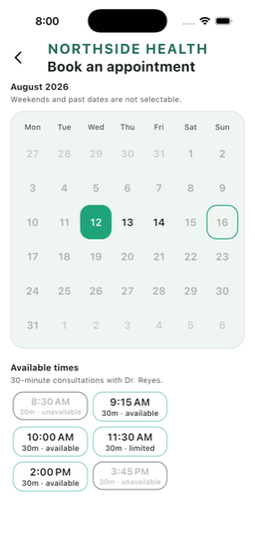

```dart
MonthCalendar<Slot>.single(
  month: DateTime(2026, 8),
  selectedDate: selected,
  onDateSelected: (date) => setState(() => selected = date),
  bounds: CalendarDateRange(DateTime(2026, 8, 12), DateTime(2026, 9, 30)),
  behavior: CalendarBehavior(
    selectableDayPredicate: (date) => date.weekday <= DateTime.friday,
  ),
)
```

*Example id: `clinic-booking`*

### Range selection — `HorizontalCalendar.controlled`

Range, multiple, and single selection share one `CalendarSelection` object and
one set of transition rules.

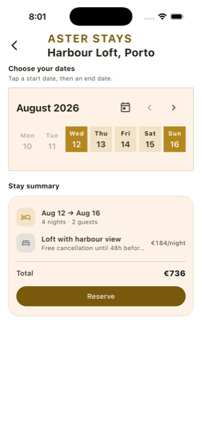

```dart
HorizontalCalendar<Stay>.controlled(
  focusedDate: focused,
  selection: selection,                      // CalendarSelection.range(...)
  onFocusedDateChanged: (date) => setState(() => focused = date),
  onSelectionChanged: (previous, next) => setState(() => selection = next),
  behavior: const CalendarBehavior(
    selectionBehavior: CalendarSelectionBehavior(maximumRangeDays: 21),
  ),
)
```

*Example id: `stay-range`*

### Day timeline — `DayTimeline`

Overlapping bookings resolved into deterministic columns, with a current-time
line that tracks the real clock and opens centred on now.

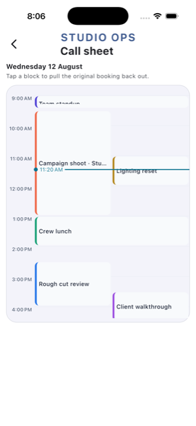

```dart
DayTimeline<Booking>(
  date: DateTime(2026, 8, 12),
  events: bookings,
  onEventTap: (event) => open(event.data),   // your record, unchanged
  configuration: const CalendarTimelineConfiguration(
    startHour: 7,
    endHour: 19,
    hourHeight: 62,
  ),
)
```

*Example id: `studio-day`*

### Week timeline — `WeekTimeline`

The same layout engine across up to fourteen day columns.

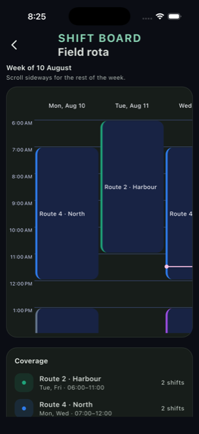

```dart
WeekTimeline<Shift>(
  startDate: DateTime(2026, 8, 10),
  events: shifts,
  configuration: const CalendarTimelineConfiguration(
    startHour: 6,
    endHour: 18,
    dayColumnWidth: 132,
  ),
)
```

*Example id: `shift-board`*

### Foldable week ↔ month — `FoldableCalendar`

One surface that interpolates its real height between a week strip and a month
grid, so a vertical drag expands it continuously rather than swapping at the
halfway mark.

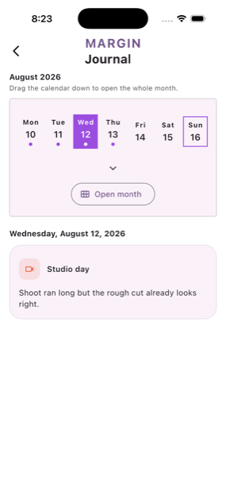

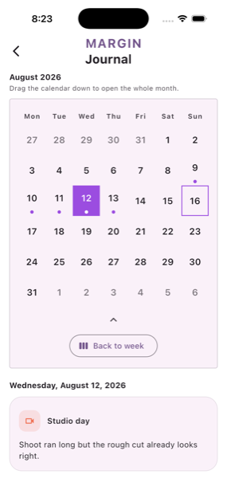

```dart
FoldableCalendar<Entry>.single(
  focusedDate: selected,
  selectedDate: selected,
  onDateSelected: (date) => setState(() => selected = date),
  foldState: fold,
  onFoldStateChanged: (state) => setState(() => fold = state),
  foldControl: CalendarFoldControl.both,
)
```

*Example id: `journal`*

### Agenda — `CalendarAgenda`

Date-grouped events from a synchronous list or an async source, with loading,
error, empty, and populated states handled for you.

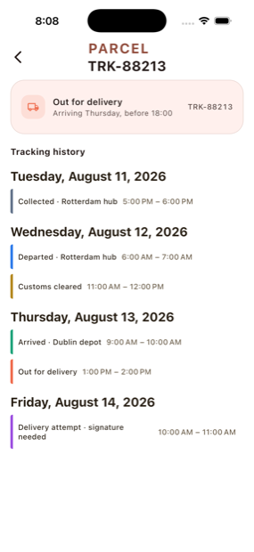

```dart
CalendarAgenda<Parcel>(
  interval: CalendarVisibleInterval(
    DateTime(2026, 8, 11),
    DateTime(2026, 8, 17),
  ),
  eventSource: parcelSource,                 // implements CalendarEventSource
  onEventTap: (event) => open(event.data),
)
```

*Example id: `parcel-agenda`*

### Activity and streaks — `CalendarStreakStrip`, `CalendarContributionHeatmap`, `CalendarInsightsDashboard`

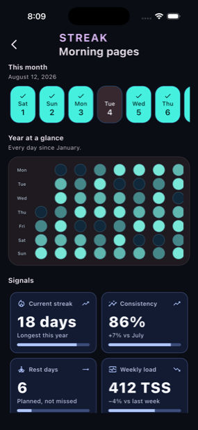

```dart
CalendarStreakStrip(
  startDate: DateTime(2026, 8, 1),
  dayCount: 31,
  completedDates: completed,
  onDateTap: (date) => setState(() => selected = date),
)

CalendarContributionHeatmap(
  startDate: DateTime(2026, 1, 1),
  dayCount: 224,
  values: intensityByDate,                   // Map<DateTime, double>
)
```

*Example id: `habit-streaks`*

### Countdown and progress — `CalendarCountdownCard`, `CalendarHeatmapStrip`, `CalendarWeekProgress`

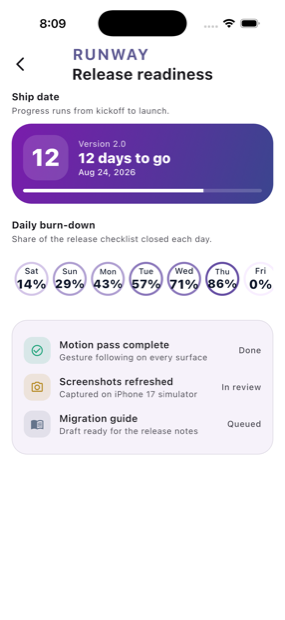

```dart
CalendarCountdownCard<Release>(
  targetDate: DateTime(2026, 8, 24),
  referenceDate: DateTime.now(),
  startDate: DateTime(2026, 7, 6),
  title: 'Version 2.0',
)
```

*Example id: `release-countdown`*

### Native pickers — `AdaptiveCalendarNavigationBar`, `CalendarCupertinoDatePicker`, `showAdaptiveCalendarPicker`

Platform chrome and native wheels driven by the same tokens as everything else.

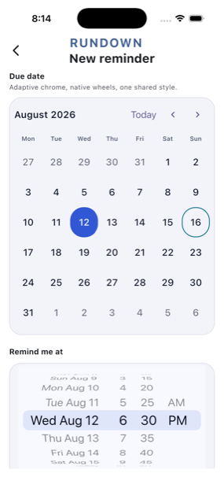

```dart
CalendarCupertinoDatePicker(
  value: remindAt,
  onChanged: (value) => setState(() => remindAt = value),
  configuration: const CalendarCupertinoPickerConfiguration(
    mode: CalendarCupertinoPickerMode.dateAndTime,
    minuteInterval: 5,
  ),
)

// Or let the platform decide the whole presentation:
final picked = await showAdaptiveCalendarPicker(
  context: context,
  initialDate: DateTime.now(),
);
```

*Example id: `native-reminder`*

### Celestial picker — `CelestialDatePicker`

A sun-and-moon horizon that scrubs dates by drag, for sleep, weather, and
wellness products.

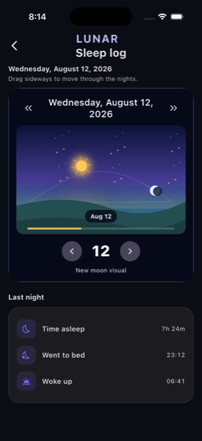

```dart
CelestialDatePicker(
  value: date,
  onChanged: (value) => setState(() => date = value),
  style: const CelestialDatePickerStyle(
    skyStyle: CelestialSkyStyle.aurora,
    composition: CelestialComposition.cinematic,
  ),
)
```

*Example id: `sleep-log`*

### Home-screen widgets — `CalendarHomeWidget`, `CalendarHomeWidgetBridge`

One serializable payload rendered across every widget family, and pushed to the
Android or iOS system widget through the bridge.

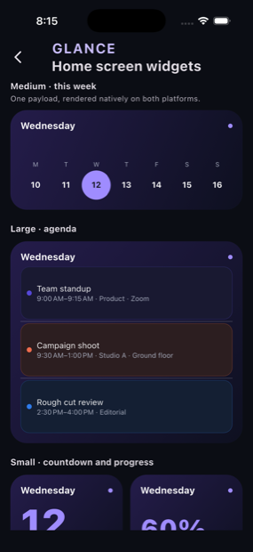

```dart
CalendarHomeWidget(
  data: CalendarHomeWidgetData(
    generatedAt: DateTime.now(),
    selectedDate: DateTime.now(),
    title: 'Wednesday',
    events: [/* CalendarHomeWidgetEvent(...) */],
  ),
  family: CalendarHomeWidgetFamily.medium,
  content: CalendarHomeWidgetContent.week,
)
```

See the [home-screen widget guide](doc/home_screen_widgets.md).
*Example id: `home-widgets`*

### Also included

`CalendarDateRail`, `CalendarScheduleRibbon`, `CalendarMilestoneTimeline`,
`CalendarAvailabilityStrip`, `CalendarDateRangeSummary`, and the reusable
pieces `CalendarHeader`, `CalendarDayCell`, `CalendarEventMarker`,
`CalendarEventTile`, `CalendarNowIndicator`, `CalendarFoldHandle`.

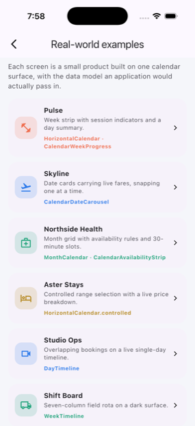

---

## Correct dates

Calendar bugs are almost always date bugs: a duplicated day, a missing day, a
week that starts on the wrong weekday after a daylight-saving change. This
package treats that as the core problem.

Every surface generates dates through `CalendarDateMath`, which works on
integer **day numbers** — days since 1970-01-01 — using the proleptic Gregorian
algorithms, and only converts to `DateTime` at the edges. It never adds
`Duration`s to dates, and never derives a day number from epoch milliseconds.

```dart
CalendarDateMath.daysFromCivil(2026, 8, 12);   // 20678
CalendarDateMath.civilFromDays(20678);         // (2026, 8, 12)
CalendarDateMath.monthGrid(DateTime(2026, 8), DateTime.monday);
CalendarDateMath.addDays(date, -400);          // exact, DST-proof
```

Three failure modes are handled explicitly, because real time zones do all of
them:

| Situation | Real example | Behaviour |
|---|---|---|
| Day is shortened or lengthened | most DST zones | dates step by civil day, never by elapsed hours |
| Local midnight does not exist | `America/Santiago` starts DST at 00:00 | the date is anchored at midday instead |
| The civil date does not exist at all | `Pacific/Apia` skipped 30 Dec 2011 crossing the date line | the date is materialized in UTC so the grid still renders it |

That last one is not hypothetical. The naive implementation produces a December
2011 grid with **no 30th and two 31sts**.

The test suite proves the invariants rather than sampling them. For every month
from 1900 to 2100 and every possible first day of week it asserts the grid is
contiguous, duplicate-free, correctly aligned, and contains each day of the
month exactly once — cross-checked against an independent oracle, and re-run in
CI under `Pacific/Apia`, `Pacific/Kiritimati`, `America/Santiago`,
`America/Havana`, `America/Sao_Paulo`, `Asia/Tehran`, `Australia/Lord_Howe`,
`Pacific/Chatham`, `America/New_York`, and `UTC`.

The 1.x `generateWeeks` entrypoint is routed through the same engine, so
existing code gets the same guarantees without changing a line.

---

## Size

Measured by building a release ARM64 APK of a minimal app that renders a
`HorizontalCalendar`, and diffing it against the identical app without the
package:

| | Compiled size |
|---|---|
| **This package's own code** | **81 KB** |
| Flutter framework retained by using Material widgets | 421 KB |
| `intl` (the only dependency) | 20 KB |

Unused surfaces are tree-shaken away completely. A build that only uses
`HorizontalCalendar` contains no trace of the celestial picker, home widgets,
insights, carousel, timelines, or agenda — verified in the size analysis, not
assumed. You pay for the surfaces you actually reference.

Of the 81 KB, about 30 KB is the 21 built-in theme presets. They are selected
by a runtime enum, so they cannot be tree-shaken individually; if you need the
floor, supply your own `HorizontalCalendarThemeData` and the presets stop being
the interesting part of your build.

Reproduce it yourself with `flutter build apk --release --analyze-size`.

---

## Theming

Style, density, indicators, semantic tokens, geometry, builders, and motion are
independent axes.

```dart
HorizontalCalendar(
  selectedDate: selected,
  onDateSelected: select,
  appearance: CalendarAppearance(
    style: CalendarStyle.cupertinoGlass,
    density: CalendarDensity.spacious,
    eventIndicatorStyle: EventIndicatorStyle.stack,
    motion: CalendarMotion.premium(),
  ),
)
```

**21 presets** — `adaptive`, `material`, `materialExpressive`, `materialYou`,
`cupertino`, `cupertinoGlass`, `cupertinoTinted`, `neutral`, `minimal`, `pill`,
`soft`, `monochrome`, `paper`, `terminal`, `luxury`, `glass`, `editorial`,
`bold`, `neon`, `aurora`, `sunset`, `midnight`.

Override any token with `HorizontalCalendarThemeData`, or read the resolved
tokens inside a custom builder:

```dart
final tokens = CalendarThemeResolver.resolve(context, appearance);
```

Set `showSurface: false` to drop the calendar's own card when your screen
already provides one — the dates then use the container's full width.

```dart
Card(
  child: HorizontalCalendar(
    selectedDate: selected,
    onDateSelected: select,
    appearance: const CalendarAppearance(
      showHeader: false,
      showSurface: false,
    ),
  ),
)
```

---

## Motion

Supplying a `CalendarMotion` turns on gesture-driven behaviour, not just
durations: pages and folds follow your finger and settle on a spring,
selection transitions are interruptible, and surfaces respond to press.

`none` · `subtle` · `fluid` · `spring` · `playful` · `snappy` · `gentle` ·
`cinematic` · `premium`

```dart
appearance: CalendarAppearance(motion: CalendarMotion.fluid()),
```

Everything honours `MediaQuery.disableAnimations`. Full details in the
[motion and gesture guide](doc/motion.md).

---

## Selection

Single, multiple, and range selection share one immutable object and one set of
rules, so the calendar never changes selection on its own — it proposes, you
accept.

```dart
CalendarSelection.single(date)
CalendarSelection.multiple([a, b])
CalendarSelection.range(CalendarDateRange(start, end))

const CalendarBehavior(
  selectionBehavior: CalendarSelectionBehavior(
    singleTap: CalendarSingleTapBehavior.toggle,
    maximumMultipleDates: 5,
    maximumRangeDays: 21,
    completedRangeTap: CalendarCompletedRangeTap.restart,
  ),
)
```

---

## Events

Events are generic over your own type, and the original object comes straight
back out of every callback.

```dart
CalendarEvent<Meeting>(
  id: meeting.id,
  start: meeting.start,
  end: meeting.end,
  title: meeting.title,
  data: meeting,
)
```

For remote data, implement `CalendarEventSource<T>`; the calendar loads the
visible interval, ignores responses that arrive after a newer interval was
requested, and exposes loading and error states.

```dart
class MeetingSource implements CalendarEventSource<Meeting> {
  @override
  Future<List<CalendarEvent<Meeting>>> load(
    CalendarVisibleInterval interval,
  ) async {
    final meetings = await api.fetch(interval.start, interval.end);
    return meetings.map(toCalendarEvent).toList();
  }
}
```

---

## Accessibility

- Full-date semantic labels, selection and disabled state, and stable
  identifiers on every date.
- Keyboard navigation: arrows, page up/down, `Enter`/`Space` to select, `T` for
  today.
- Text scaling, bold text, high contrast, dark mode, and reduced motion are
  supported on every built-in surface.
- Chronological navigation stays correct in RTL while the visuals mirror.
- Layouts scroll, wrap, or grid instead of overflowing.

---

## Example app

```sh
cd example
flutter run
```

- **Real-world examples** — the thirteen screens shown above.
- **Playground** — every style, density, motion, selection, and scrolling
  option, with live callback output and a copyable Dart recipe.
- **Home-widget studio** — every family, content mode, and token, and a button
  that pushes the configuration to the real system widget.

---

## Upgrading from 1.x

The 1.x entrypoint still works and now shares the 2.0 date engine:

```dart
import 'package:horizontal_weekly_calendar/weekly_calendar.dart';
```

Deprecated members carry direct replacements, so migration can happen screen by
screen. New code should import
`package:horizontal_weekly_calendar/horizontal_weekly_calendar.dart`.

See the [2.0 migration guide](doc/migration_v2.md).

---

## Documentation

- [Motion and gesture guide](doc/motion.md)
- [2.0 migration guide](doc/migration_v2.md)
- [Home-screen widget integration](doc/home_screen_widgets.md)
- [API reference](https://pub.dev/documentation/horizontal_weekly_calendar/latest/)
- [Changelog](CHANGELOG.md)
- [Issue tracker](https://github.com/AhmedZaeem/horizontal_weekly_calendar/issues)

## Contributing

```sh
flutter analyze
flutter test
dart format --output=none --set-exit-if-changed .
```

Changes to date arithmetic, selection rules, or responsive behaviour need tests
covering those systems.

## License

MIT. See [LICENSE](LICENSE).
